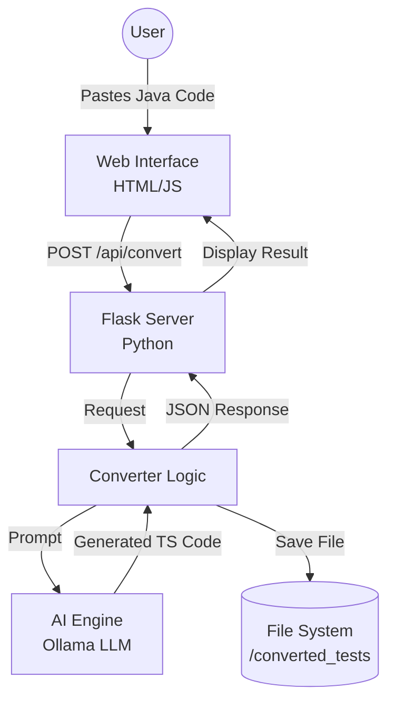

# BlastFW: Selenium to Playwright Converter

**BlastFW** is an intelligent automation migration tool designed to modernize legacy test suites. It leverages a local Large Language Model (Ollama) to accurately convert Selenium (Java) test scripts into robust, asynchronous Playwright (TypeScript/JavaScript) tests.

## 🚀 Features

- **AI-Powered Conversion:** Uses strict prompting instructions to handle the complex paradigm shift from synchronous Selenium to asynchronous Playwright.
- **Smart Selector Mapping:** Automatically translates `By.id`, `By.xpath`, etc., to Playwright's distinct Locators.
- **Assertion Translation:** Converts TestNG/JUnit assertions into Playwright's web-first `expect` assertions.
- **Instant Preview:** Web-based UI (Flask) provides a side-by-side view of input and output.
- **Auto-Persist:** Converted tests are automatically saved to the `converted_tests` directory with unique timestamps.

## 🏗️ Architecture

The system follows a 3-layer architecture (B.L.A.S.T Protocol) ensuring separation of concerns between the UI, Logic, and AI Engine.



## 🛠️ Prerequisites

- **Python 3.10+**: Core backend runtime.
- **Ollama**: Local AI model runner.
    - Ensure `codellama` or a compatible model is pulled: `ollama pull codellama`
    - Ensure Ollama is running: `ollama serve`

## 📦 Installation

1.  **Clone the repository:**
    ```bash
    git clone https://github.com/ravichitturi2675/AIExplore.git
    cd AIExplore
    ```

2.  **Set up Virtual Environment (Optional but Recommended):**
    ```bash
    python -m venv venv
    source venv/bin/activate  # On Windows: venv\Scripts\activate
    ```

3.  **Install Dependencies:**
    ```bash
    pip install flask requests
    ```

## 🏃 Usage

1.  **Start the Application:**
    ```bash
    python tools/app.py
    ```
    *(Note: On some Windows configurations with multiple Python versions, you may need to use `py tools/app.py`)*

2.  **Open in Browser:**
    Navigate to [http://localhost:5000](http://localhost:5000).

3.  **Convert Code:**
    - Paste your Selenium Java class or method into the left panel.
    - Click **"Convert to Playwright"**.
    - View the generated TypeScript code in the right panel.
    - The file is also saved locally in `converted_tests/`.

## 📂 Project Structure

```text
P1-BlastFW/
├── tools/                  # Application Logic (Layer 3)
│   ├── app.py              # Flask Web Server
│   ├── converter.py        # Conversion Logic
│   ├── ai_engine.py        # AI Model Wrapper
│   └── templates/
│       └── index.html      # Frontend Interface
├── converted_tests/        # Output Directory for converted files
├── architecture/           # System SOPs (B.L.A.S.T Layer 1)
├── findings.md             # Research & Constraints Log
└── task_plan.md            # Project Roadmap
```

## 🤝 Contribution

Contributions are welcome! Please follow the B.L.A.S.T architecture principles when adding new features:
1.  **Plan** in `task_plan.md`.
2.  **Document** changes in `findings.md`.
3.  **Implement** in `tools/` with modular scripts.

-- Venkata Ravi Kiran Chitturi*
